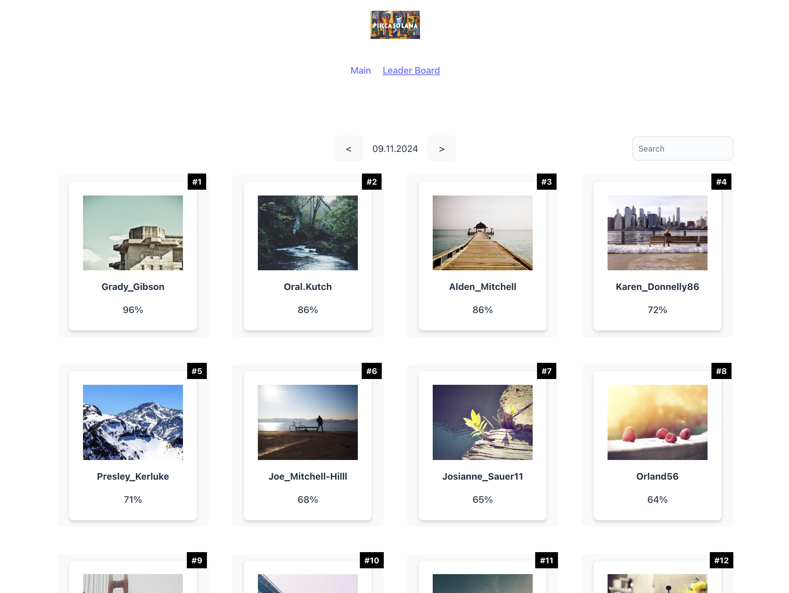
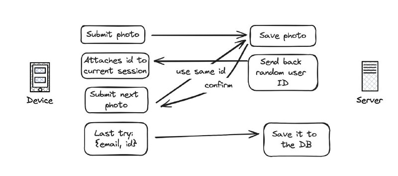

# Picassolano client


---



# Mechanics



## Tech

- **Vite**: A blazing fast frontend build tool that provides lightning-fast cold server start and hot module replacement (HMR).
- **React**: A JavaScript library for building user interfaces.
- **TypeScript**: A superset of JavaScript that adds static type-checking and other features to the language.
- **ESLint**: A tool for identifying and reporting on patterns found in ECMAScript/JavaScript code.
- **Prettier**: An opinionated code formatter that enforces a consistent code style.
- **React Router**: Declarative routing for React applications.
- **Tailwind CSS**: A utility-first CSS framework for building custom designs quickly.

## Getting Started

### Prerequisites

- Node.js and npm installed on your machine.

### Installation

1. Clone the repository:

   ```bash
   git clone git@github.com:Picasolana/picassolano-client.git
   ```

2. Navigate to the project directory:

   ```bash
   cd picassolano-client
   ```

3. Install dependencies:

   ```bash
   npm i
   ```

### Development

To start the development server, run:

```bash
npm run dev
```

This will start the Vite development server and open your default web browser to display the application.

### Build

To build the project for production, run:

```bash
npm run build
```

This will generate a production-ready build of your application in the `dist` directory.

## Folder Structure

```
vite-react-ts-project/
├── public/          # Public assets and HTML template
├── src/             # Source code
│   ├── components/  # React components
│   ├── pages/       # React pages
│   ├── App.tsx      # Main application component
│   └── index.tsx    # Entry point
├── .gitignore       # Git ignore file
├── package.json     # Project metadata and dependencies
├── README.md        # Project README file (you're here!)
├── tsconfig.json    # TypeScript configuration
└── vite.config.ts   # Vite configuration
```

## License

This project is licensed under the MIT License - see the [LICENSE](LICENSE) file for details.
